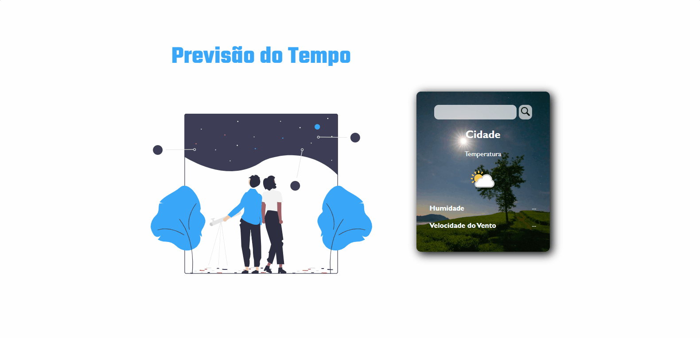
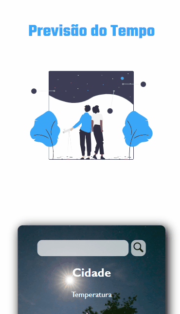

<h1 align="center">One Piece</h1>
 

### 🚨 Sobre o Projeto

Este projeto consiste em um aplicativo de previsão do tempo desenvolvido utilizando HTML, CSS e JavaScript, com integração à API do Weather API. O objetivo é proporcionar ao usuário uma interface simples e intuitiva para visualizar as condições climáticas atuais e previsões para diferentes locais. O frontend foi criado com HTML e estilizado com CSS, garantindo um design responsivo e agradável. O JavaScript foi utilizado para consumir a API do tempo, processando os dados de temperatura, umidade, vento e descrição do clima. O aplicativo permite que o usuário insira o nome da cidade e, em tempo real, receba as informações meteorológicas atualizadas. A API utilizada fornece dados precisos e rápidos, permitindo uma experiência interativa e dinâmica. Meu primeiro projeto utilizando API, tive algumas dificuldades mas com pesquisa consegui desenvolver sem muitas complicações.

<strong>Link:<strong> 

### 🔨 Ferramentas Utilizadas

* [HTML](https://developer.mozilla.org/pt-BR/docs/Web/HTML)
* [CSS](https://developer.mozilla.org/pt-BR/docs/Web/CSS)
* [JSS](https://developer.mozilla.org/pt-BR/docs/Web/JavaScript)
* [WEATHER API](https://www.weatherapi.com)

### 📽️ Projeto 

    </img>
    
Landing page aberta no Desktop

 
 

    </img>
    
Landing page aberta no Mobile

